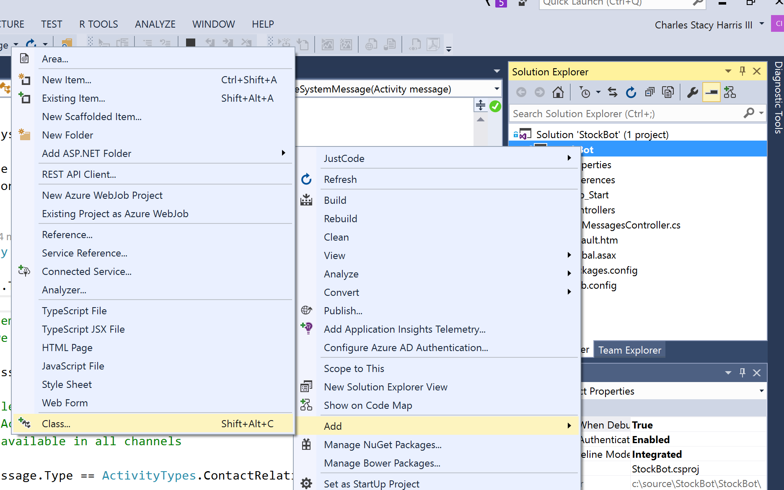

# Bot Demo Steps

## Part 1: Basic Bot
1. Let's start in Visual Studio and create a new project. Select File|New|Project and then select the **Bot Application** template.


### Notes:
* The bot is hosted in a web service so that it can be hosted on the internet.
* The bot connectors - which we'll see in a bit - can send and receive messages with your bot.
* We will need to secure the channel with your bot. We do this by using an ***app id*** and ***app password*** stored in the ***web.config*** file.

2. Add an ***app id*** and ***app password*** to web.config.  
We'll use blank values for now, but you'll want more secure values for production.
  

3. Next take a look at ***default.htm*** This file is used for information about your bot if your users should happen to browse to your bots URL.
  

4. Open the ***MessageController.cs*** file. The main action happens in the ***MessageController.cs*** file. If you're an ASP.NET Web API developer, this will look familiar to you. It's just a place where the service can handle **HTTP POST*** messages.

5. Walk through and explain this code:

### Notes:
* Note the return type and the parameter type. We'll see some details of these momentarily.
* The template bot simply returns a message telling you how many characters you typed.
* The standard conversational Activity message is of type ***ActivityTypes.Message***
* Note also that there is a default handler for system messages.

6. Make sure that the ***Bot Framework Channel Emulator*** is running.  

7. Build and run the application. This will run in IIS express and wil bring up the default page in your browser.  

8. Switch to the ***channel emulator*** and make sure that the URL, appid, and app password are correct.  

9. Try typing some text to the bot. Examine the return values in JSON format.  

10. Do a quick tour of the **channel emulator*** tool.  

## Part 2:  Stock Lookup Logic
1. Add a new class to the project. Name the class ***Yahoo***.



2. Replace the generated code with the following. The code uses the Yahoo stock API to get values for the stock symbols.
```cs
using System;
using System.Net;
using System.Threading.Tasks;
using Newtonsoft.Json;

namespace StockBot
{
    class Yahoo
    {
        public static async Task<string> GetStock(string strStock)
        {
            string strRet = string.Empty;
            double? dblStock = await Yahoo.GetStockPriceAsync(strStock);

            if (null == dblStock)   // might be a company name rather than a stock ticker name
            {
                string strTicker = await GetStockTickerName(strStock);
                if (string.Empty != strTicker)
                {
                    dblStock = await Yahoo.GetStockPriceAsync(strTicker);
                    strStock = strTicker;
                }
            }

            // return our reply to the user
            if (null == dblStock)
            {
                strRet = string.Format("Stock {0} doesn't appear to be valid", strStock.ToUpper());
            }
            else
            {
                strRet = string.Format("Stock: {0}, Value: {1}", strStock.ToUpper(), dblStock);
            }

            return strRet;
        }

        private static async Task<double?> GetStockPriceAsync(string symbol)
        {
            if (string.IsNullOrWhiteSpace(symbol))
                return null;

            string url = $"http://finance.yahoo.com/d/quotes.csv?s={symbol}&f=sl1";
            string csv;
            using (WebClient client = new WebClient())
            {
                csv = await client.DownloadStringTaskAsync(url).ConfigureAwait(false);
            }
            string line = csv.Split('\n')[0];
            string price = line.Split(',')[1];

            double result;
            if (double.TryParse(price, out result))
                return result;

            return null;
        }

        private static async Task<string> GetStockTickerName(string strCompanyName)
        {
            string strRet = string.Empty;
            string url = $"http://d.yimg.com/autoc.finance.yahoo.com/autoc?query={strCompanyName}&region=1&lang=en&callback=YAHOO.Finance.SymbolSuggest.ssCallback";
            string sJson = string.Empty;
            using (WebClient client = new WebClient())
            {
                sJson = await client.DownloadStringTaskAsync(url).ConfigureAwait(false);
            }

            sJson = StripJsonString(sJson);
            YahooCompanyLookup lookup = null;
            try
            {
                lookup = JsonConvert.DeserializeObject<YahooCompanyLookup>(sJson);
            }
            catch (Exception e)
            {

            }

            if (null != lookup)
            {
                foreach (lResult r in lookup.ResultSet.Result)
                {
                    if (r.exch == "NAS")
                    {
                        strRet = r.symbol;
                        break;
                    }
                }
            }

            return strRet;
        }

        // String retrurned from Yahoo Company name lookup contains more than raw JSON
        // strip off the front/back to get to raw JSON
        private static string StripJsonString(string sJson)
        {
            int iPos = sJson.IndexOf('(');
            if (-1 != iPos)
            {
                sJson = sJson.Substring(iPos + 1);
            }

            iPos = sJson.LastIndexOf(')');
            if (-1 != iPos)
            {
                sJson = sJson.Substring(0, iPos);
            }

            return sJson;
        }
    }

    public class lResult
    {
        public string symbol { get; set; }
        public string name { get; set; }
        public string exch { get; set; }
        public string type { get; set; }
        public string exchDisp { get; set; }
        public string typeDisp { get; set; }
    }

    public class ResultSet
    {
        public string Query { get; set; }
        public lResult[] Result { get; set; }
    }

    public class YahooCompanyLookup
    {
        public ResultSet ResultSet { get; set; }
    }

}
```
3. Replace the ***Post*** in the MessageController with the following code:
```cs
public async Task<HttpResponseMessage> Post([FromBody]Activity activity)
{
    if (activity.Type == ActivityTypes.Message)
    {
        ConnectorClient connector = new ConnectorClient(new Uri(activity.ServiceUrl));
                        
        // calculate something for us to return
        int length = (activity.Text ?? string.Empty).Length;

        // Get the stock value from Yahoo.
        string stock = await Yahoo.GetStock(activity.Text);

        // return our reply to the user
        Activity reply = activity.CreateReply(stock);
        await connector.Conversations.ReplyToActivityAsync(reply);
    }
    else
    {
        HandleSystemMessage(activity);
    }
    var response = Request.CreateResponse(HttpStatusCode.OK);
    return response;
}
```

4. Return to slide deck and/or explain the following:
* This bot is not a very good because it's not very conversational.
* As the user, I had to know the protocol for interacting with the bot. I had to know that you can only type in stock symbols.
* Wouldn't it be better if we could have a more natural conversation with the bot?

## Part 3 LUIS Integration
For this section, you'll need a LUIS model for parsing conversations about stocks. You can find thi at: [https://github.com/Microsoft/BotBuilder/blob/master/CSharp/Samples/Stock_Bot/Luis_Model/Stock%20Model.json](https://github.com/Microsoft/BotBuilder/blob/master/CSharp/Samples/Stock_Bot/Luis_Model/Stock%20Model.json)  
It's also included in the presentation zip files.

1. Show the audience what the LUIS model looks like in the web portal [http://www.luis.ai/](http://www.luis.ai/)  

2. Click the ***Review Labels*** tab.  

3. Talk about:
    * Intents - What is it the user intends or wants to accomplish?
    * Entities - What are the things that the user is talking about?
  
4. Click the publish link (make sure you have trained the model first) and enter an utterance. Click the URL to see the result of the LUIS model.  

5. Now let's add code to handle the LUIS model in C#. (Show the paste JSON as classes if you want, but we'll use the code below.)
Add a new class to the application and call it ***Luis***.


6. Replace the generated code with the following:
```cs
using Newtonsoft.Json;
using System;
using System.Net.Http;
using System.Threading.Tasks;

namespace StockBot
{
    public class LUISStockClient
    {
        public static async Task<StockLUIS> ParseUserInput(string strInput)
        {
            string strRet = string.Empty;
            string strEscaped = Uri.EscapeDataString(strInput);

            using (var client = new HttpClient())
            {
                string uri = "https://api.projectoxford.ai/luis/v1/application?id=2be72bf7-c6e4-42de-9564-dec41286706f&subscription-key=697fb019e88b4b94b7c4144b8fa740d8&q=" + strEscaped;

                HttpResponseMessage msg = await client.GetAsync(uri);

                if (msg.IsSuccessStatusCode)
                {
                    var jsonResponse = await msg.Content.ReadAsStringAsync();
                    var _Data = JsonConvert.DeserializeObject<StockLUIS>(jsonResponse);
                    return _Data;
                }
            }
            return null;
        }
    }

    public class StockLUIS
    {
        public string query { get; set; }
        public lIntent[] intents { get; set; }
        public lEntity[] entities { get; set; }
    }

    public class lIntent
    {
        public string intent { get; set; }
        public float score { get; set; }
    }

    public class lEntity
    {
        public string entity { get; set; }
        public string type { get; set; }
        public int startIndex { get; set; }
        public int endIndex { get; set; }
        public float score { get; set; }
    }
}
```
7. Replace the URI with the URI of your trained LUIS model.

8. Walk through the LUIS code. Note:
    * It uses simple HTTP calls to call the LUIS model.
    * It gets back a JSON packet that contains the intent and entities from LUIS.

9. Open the ***MessageController.cs*** file and replace the ***Post*** function with the following code:
```cs
public async Task<HttpResponseMessage> Post([FromBody]Activity activity)
{
    if (activity.Type == ActivityTypes.Message)
    {
        bool bSetStock = false;
        StockLUIS stLuis = await LUISStockClient.ParseUserInput(activity.Text);
        string strRet = string.Empty;
        string strStock = activity.Text;

        ConnectorClient connector = new ConnectorClient(new Uri(activity.ServiceUrl));

        // Get the stateClient to get/set Bot Data
        StateClient stateClient = activity.GetStateClient();
        BotData botData = stateClient.BotState.GetUserData(activity.ChannelId, activity.Conversation.Id);

        switch (stLuis.intents[0].intent)
        {
            case "RepeatLastStock":
                strStock = botData.GetProperty<string>("LastStock");

                if (null == strStock)
                {
                    strRet = "I don't have a previous stock to look up!";
                }
                else
                {
                    strRet = await Yahoo.GetStock(strStock);
                }
                break;
            case "StockPrice":
                bSetStock = true;
                strRet = await Yahoo.GetStock(stLuis.entities[0].entity);
                break;
            case "None":
                strRet = "Sorry, I don't understand, perhaps try something like \"Show me Microsoft stock\"";
                break;
            default:
                break;
        }

        if (bSetStock)
        {
            botData.SetProperty<string>("LastStock", stLuis.entities[0].entity);
            stateClient.BotState.SetUserData(activity.ChannelId, activity.Conversation.Id, botData);
        }
        // return our reply to the user
        Activity reply = activity.CreateReply(strRet);
        await connector.Conversations.ReplyToActivityAsync(reply);
    }
    else
    {
        HandleSystemMessage(activity);
    }
    var response = Request.CreateResponse(HttpStatusCode.OK);
    return response;
}
```
Notes:
* In this code we want to start maintaining conversational state. For example, we might ask "What's the price of MSFT?", then later ask "What is it now?"
* In order to maintain state, we will use the bot framework to store conversational state data for us.
    * We use ***BotData*** which is a property bag to organize the data that we want to keep.
    * We then store this data using the **StateClient*** which can store user specific and conversation specific data.
    * Take a look at this in the code.
* You'll also notice that now that we're talking to LUIS, we understand something about the intent of the user.
    * Show LUIS return data in the debugger.
    * Note the switch statement where we switch on the intent that LUIS returned.
* Note the way that the reply is generated from the incoming activity. It's done this way so that we can set context/state on the current conversation.

## Part 4 - Publish Our Bot to Azure
Our bot can be hosted anywhere. It can be in our own data center or in the cloud. In this case, we're going to publish it to the Azure cloud.

1. In the solution explorer right click and choose "Publish".


2. In the publish dialog choose ***Azure App Service***


3. Create a new App Service for your bot


4. After publishing, your web browser should open to your bot's default page.

5. On the default page, you click the link to take you to the bot framework home page. (Tip: Open this in a new tab)


